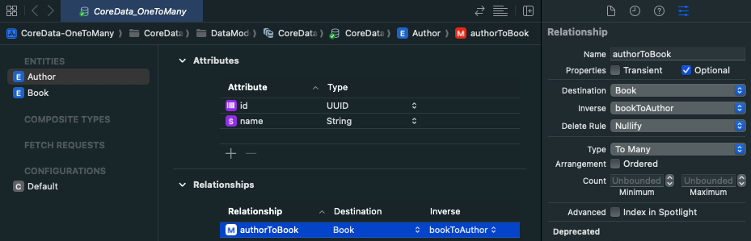

# CoreData-OneToMany
## Overview
Demonstration of how to setup one to many relationships in core data. 

Example: If you need to have a database nested inside another database. 
- This project contains two core data entities .. Author and Book.
- The app allows the user to create Authors and then associate more than one Book to an Author.

## Demo

## Notes
When setting up the core data entities, the following changes were made in the inspector panel.

- Author > Codegen: Manual/None

- Author > authorToBook > Type: To Many
